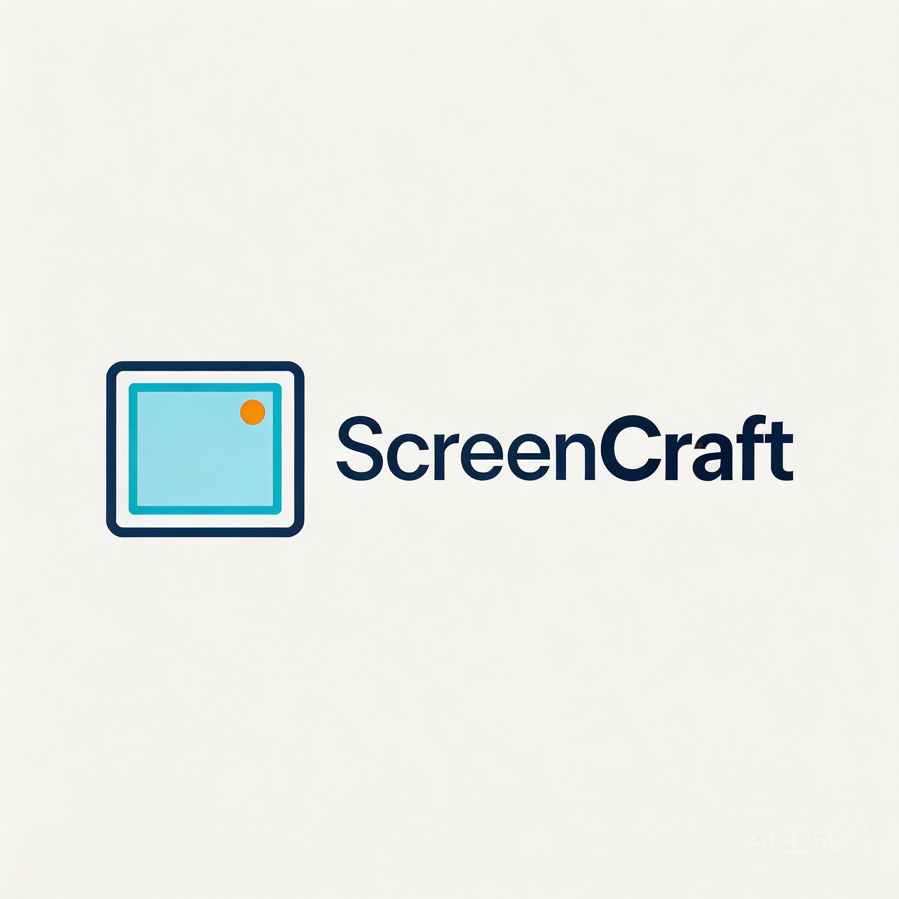

<p align="center">
  
</p>

<p align="center">
  <strong>High-performance screen recording with precision input tracking</strong>
</p>

<p align="center">
  <a href="https://github.com/BruceY-rgb/ElecScreenRcorder/releases"></a>
  
  
  
  <a href="LICENSE"></a>
</p>

---

## Overview

ScreenCraft is a Windows desktop screen recording application built with **Electron + React** (UI) and a **C++ Native Core** (recording engine). It captures high-quality video via DXGI Desktop Duplication, records system audio and microphone through WASAPI, and simultaneously tracks keyboard/mouse input at high frequency for research and analysis purposes.

## Features

### Recording

- **High-Quality Video** -- Up to 4K@120fps with hardware-accelerated encoding
- **Hardware Encoder Priority** -- NVENC (NVIDIA) > AMF (AMD) > QSV (Intel) > x264 fallback
- **Screen Capture** -- DXGI Desktop Duplication (ddagrab) with GDI fallback
- **Configurable Quality** -- Resolution (720p/1080p/2K/4K), frame rate (30/60/120 FPS), bitrate (8-35 Mbps)
- **Pause & Resume** -- Segment-based recording with seamless concatenation
- **MKV to MP4** -- Optional automatic remux after recording

### Audio

- **System Audio** -- Native WASAPI loopback capture (no virtual audio drivers needed)
- **Microphone** -- WASAPI input capture with device enumeration and selection
- **Separate Audio Tracks** -- Record system audio and microphone to independent tracks

### Input Tracking

- **Keyboard Events** -- Global `WH_KEYBOARD_LL` hook capturing keycode, character, and modifier keys
- **Mouse Click Events** -- Global `WH_MOUSE_LL` hook capturing position, button, and modifiers
- **Mouse Trajectory** -- 200Hz polling (5ms interval) via `GetCursorPos` with delta calculation
- **High-Precision Timestamps** -- `GetSystemTimePreciseAsFileTime` for sub-microsecond accuracy
- **Pause-Aware Timing** -- Paused durations are excluded from relative timestamps

### UI & Workflow

- **System-Wide Hotkeys** -- Configurable Start/Pause/Stop shortcuts with combined key support (Ctrl+Alt+Shift+Key)
- **Overlay Window** -- Always-on-top, frameless, draggable status display — automatically excluded from recordings via `SetWindowDisplayAffinity`
- **Real-Time Monitoring** -- Recording timer, mouse activity rate (events/sec), system info display
- **Auto-Organization** -- Automatically organize output files into timestamped folders
- **Pre-Recording Check** -- Detects stuck keyboard keys before recording starts

## System Requirements

| Component | Minimum |
|-----------|---------|
| OS | Windows 10 64-bit (version 1803+) |
| RAM | 8 GB |
| GPU | DirectX 11 compatible |
| Disk | SSD recommended for high-bitrate recording |

**Hardware encoder requirements (optional, falls back to x264):**

| Encoder | Minimum GPU |
|---------|-------------|
| NVENC | NVIDIA GeForce GTX 600 series+ (driver 570.0+) |
| AMF | AMD Radeon RX 200 series+ |
| QSV | Intel 6th gen Core (Skylake)+ |

## Architecture

ScreenCraft uses a **Sidecar Architecture** where the Electron app manages the UI and lifecycle, while a native C++ process handles all performance-critical work:

```
┌──────────────────────────────────────────────────────────────┐
│                      Electron App                            │
│                                                              │
│  ┌──────────────┐   ┌──────────────┐   ┌──────────────┐    │
│  │   React UI   │◄─►│  Main Proc   │◄─►│   Preload    │    │
│  │              │   │              │   │   Bridge     │    │
│  │ - Controls   │   │ - IPC        │   │              │    │
│  │ - Settings   │   │ - Hotkeys    │   │ - 20+ APIs   │    │
│  │ - Overlay    │   │ - Lifecycle  │   │              │    │
│  └──────────────┘   └──────┬───────┘   └──────────────┘    │
└─────────────────────────────┼────────────────────────────────┘
                              │ stdio / socket (JSON)
                              ▼
┌──────────────────────────────────────────────────────────────┐
│                recorder_core.exe  (C++17)                    │
│                                                              │
│  ┌───────────┐  ┌──────────────┐  ┌──────────┐             │
│  │  FFmpeg   │  │ Input Capture│  │   CSV    │             │
│  │  Engine   │  │              │  │  Writer  │             │
│  │           │  │ - KB Hook    │  │          │             │
│  │ - ddagrab │  │ - Mouse Hook │  │ - actions│             │
│  │ - WASAPI  │  │ - 200Hz Poll │  │ - moves  │             │
│  │ - Encode  │  │ - Lock-free Q│  │          │             │
│  └───────────┘  └──────────────┘  └──────────┘             │
└──────────────────────────────────────────────────────────────┘
```

## Tech Stack

| Layer | Technology | Version |
|-------|-----------|---------|
| Desktop Framework | Electron | 28+ |
| UI | React + TypeScript | 18 / 5.3 |
| Build Tool | Vite | 5 |
| Native Core | C++17 (MSVC) | - |
| Screen Capture | DXGI Desktop Duplication (ddagrab) | - |
| Audio Capture | WASAPI (loopback + input) | - |
| Video Encoding | FFmpeg (as child process) | N-123522 |
| Input Hooks | Win32 API (SetWindowsHookEx) | - |
| Lock-Free Queue | moodycamel::ReaderWriterQueue | - |
| JSON Protocol | nlohmann/json | - |
| Packaging | electron-builder (NSIS) | 24 |

## Output Files

Each recording session produces up to three files:

| File | Format | Description |
|------|--------|-------------|
| `video.mkv` / `.mp4` | MKV or MP4 | Video with embedded audio tracks |
| `actions.csv` | CSV | Discrete keyboard & mouse click events |
| `movements.csv` | CSV | Mouse trajectory at 200Hz |

### CSV Format

**actions.csv** — Keyboard presses, mouse clicks with full modifier key state:

```csv
type,time,rawTime,x,y,button,keycode,keyChar,altKey,ctrlKey,shiftKey,metaKey
MOUSE_DOWN,469,1765289833003,333,981,1,,,false,false,false,false
KEY_DOWN,18617,1765289851151,,,,25,P,false,false,false,false
```

**movements.csv** — High-frequency mouse position with delta movement:

```csv
time,rawTime,x,y,dx,dy
0,1765289833003,333,981,0,0
5,1765289833008,343,991,10,10
```

> `time` is milliseconds relative to recording start (pause-adjusted). `rawTime` is the absolute system timestamp.

## Quick Start

### Prerequisites

- Windows 10/11 (x64)
- Node.js 18+
- Visual Studio 2022 with C++ workload (for building the native core)
- CMake 3.20+

### Install & Run

```bash
# Install dependencies
npm install

# Development mode (with hot reload)
npm run dev
```

### Build from Source

```bash
# Build the C++ Native Core
cd native
cmake -B build -G "Visual Studio 17 2022" -A x64
cmake --build build --config Release

# Build & package the Electron app
cd ..
npm run build:electron
```

The packaged installer will be in `release-portable/ScreenCraft Setup.exe`.

### Download

Pre-built installers are available on the [Releases](https://github.com/BruceY-rgb/ElecScreenRcorder/releases) page.

## Project Structure

```
ScreenCraft/
├── native/                          # C++ Native Core
│   ├── src/
│   │   ├── main.cpp                # Entry point, JSON protocol loop
│   │   ├── recorder.cpp            # FFmpeg process management, encoding
│   │   ├── audio_capture.cpp       # WASAPI loopback & mic capture
│   │   ├── input_capture.cpp       # Keyboard/mouse hooks + 200Hz polling
│   │   ├── csv_writer.cpp          # Thread-safe CSV output
│   │   ├── protocol.cpp            # JSON command parser
│   │   ├── system_info.cpp         # Hardware detection (CPU/GPU/RAM)
│   │   └── audio_device.cpp        # Audio device enumeration
│   ├── CMakeLists.txt
│   └── dist/                       # Build output (exe + DLLs)
├── src/
│   ├── main/                       # Electron main process
│   │   ├── index.ts               # App lifecycle, hotkey registration
│   │   ├── services/
│   │   │   └── RecorderService.ts # Native core process management
│   │   └── windows/
│   │       └── mainWindow.ts      # Main + overlay BrowserWindow
│   ├── preload/
│   │   └── index.ts               # contextBridge (20+ IPC methods)
│   └── renderer/                   # React UI
│       └── src/
│           ├── App.tsx
│           └── components/
│               ├── RecordingControls.tsx  # Main recording UI
│               ├── OverlayDisplay.tsx     # Floating overlay
│               └── SystemStatus.tsx       # Hardware info footer
├── docs/
│   ├── plan.md                    # Requirements specification
│   └── product-design.md          # Technical design document
├── electron-builder.yml
├── package.json
└── README.md
```

## Communication Protocol

The Electron app and native core communicate via JSON over stdio:

```jsonc
// Commands (stdin → recorder_core.exe)
{"action": "start", "config": {"resolution": "2k", "fps": 60, "savePath": "D:/recordings"}}
{"action": "pause"}
{"action": "resume"}
{"action": "stop"}
{"action": "getSystemInfo"}

// Responses (stdout → Electron)
{"type": "status", "state": "recording"}
{"type": "error", "msg": "Encoder initialization failed"}
{"type": "finish", "videoPath": "...", "actionsPath": "...", "movementsPath": "..."}
```

## License

[MIT](LICENSE)
